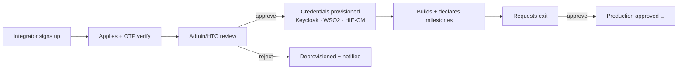
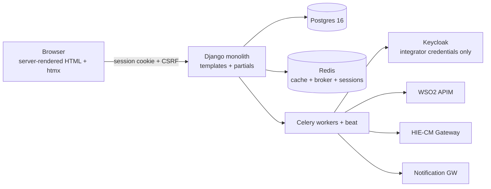

# ABDM Sandbox 2.0 — Master Plan

**Status:** adopted · **Updated:** 2026-08-28 · **This document is the single authoritative source.** Everything else — the domain docs (01–08) and the ticket files ([v0-tickets/](v0-tickets/README.md)) — hangs off this file.

---

## 1. In plain words

The **ABDM Sandbox** is the front door for companies that want to connect their health software to India's ABDM ecosystem. An _integrator_ (say, a hospital-software vendor) comes to the portal, applies, gets reviewed, and — if approved — receives **working test credentials** wired into three real systems (Keycloak for identity, WSO2 for the API gateway, HIE-CM for the health-data bridge registry). They build against the sandbox, declare their progress through **milestones**, and finally request **exit**: approval to go to production.

The current portal (the **legacy system** — a Java/Spring Boot backend plus a React frontend) works, but it was built unsustainably: passwords and private keys committed to git, no tests that run, no database migrations, security checks that don't check, and integrations that silently half-complete. Rather than patch it, we are rebuilding it as **one Django application** that renders its own HTML pages (Django templates + htmx + Tailwind — no separate frontend app, no JavaScript build for product code).

The rebuild ships in two stages:

- **v0 (POC)** — the smallest complete portal: one application type (SANDBOX), the full journey from sign-up to production approval, **real credential provisioning**, run as an invite-only pilot while the legacy portal stays live. Defined in §6, built from the ticket files in [v0-tickets/](v0-tickets/README.md).
- **v1 (everything else)** — the remaining application kinds, conformance testing, reference environment, content/docs migration, reporting, support tickets, and hardening; after this the legacy portal is decommissioned. Defined in §7 and in each domain doc's "v1" section.

## 2. How to read this plan

| You are…                          | Read                                                                                                              |
| --------------------------------- | ----------------------------------------------------------------------------------------------------------------- |
| Anyone (PM, reviewer, new joiner) | §1, §6.1, and each domain doc's **"In plain words"** section                                                      |
| An engineer picking up v0 work    | your ticket in [v0-tickets/](v0-tickets/README.md) — each is self-contained — plus the linked domain-doc sections |
| An engineer designing/reviewing   | the relevant domain doc's **Design** + **v0/v1** sections; this file for decisions & rules                        |

| #   | Document                                   | Domain                                                              |
| --- | ------------------------------------------ | ------------------------------------------------------------------- |
| —   | 00-master-plan.md                          | This doc — context, decisions, v0/v1 scope, risks                   |
| 1   | [01-backend.md](01-backend.md)             | Django apps, domain model, workflow engine, services/selectors      |
| 2   | [02-ui.md](02-ui.md)                       | Templates, htmx idioms, Tailwind design system, docs portal         |
| 3   | [03-database.md](03-database.md)           | Schema, base-model conventions, migrations, JSONB payloads, seeding |
| 4   | [04-observability.md](04-observability.md) | Logging, tracing, metrics, health, alerting                         |
| 5   | [05-security.md](05-security.md)           | Auth model, authz idioms, secrets, hardening                        |
| 6   | [06-integrations.md](06-integrations.md)   | Keycloak, WSO2, HIE-CM, notifications, adapters                     |
| 7   | [07-infra-cicd.md](07-infra-cicd.md)       | Repo layout, toolchain, containers, CI/CD, environments             |
| 8   | [08-testing.md](08-testing.md)             | Test strategy, route-gate matrix, e2e, load, parity                 |

Every domain doc follows the same shape: **In plain words → Legacy findings → Design → v0 (POC) → v1 (everything else) → Definition of done.**

## 3. Architecture & code structure

**One deployable:** a Django monolith (+ Celery workers) — server-rendered HTML, sessions + CSRF, htmx for interactivity, Tailwind for styling. The build lives in the `sandbox-v2` repo (Python 3.14 / Django 6.0, cookiecutter-django layout, uv toolchain). V0.1 Foundation is already committed.

**Model conventions follow the care backend** (the open-source Care EMR's Django codebase is our structural reference — see [03-database.md](03-database.md) §3):

- Shared abstract `BaseModel`: `external_id` (UUID, unique, indexed — the only URL identity), `created_date` / `modified_date` (auto, indexed), soft-delete `deleted` flag with a default manager that filters it; `delete()` flips the flag.
- Audit-bearing models add `created_by` / `updated_by` FKs.
- Uniqueness on soft-deletable tables is enforced with partial unique indexes (`WHERE deleted = false`).
- Layering per app mirrors care's model/spec/viewset separation, adapted to templates: `models.py` (schema + domain methods) · `forms.py` (validation) · `views.py` (HTTP only, never writes) · `services.py` (writes) · `selectors.py` (reads).

## 4. Locked decisions

| Decision                                                                          | Rationale                                                                                                                                                            |
| --------------------------------------------------------------------------------- | -------------------------------------------------------------------------------------------------------------------------------------------------------------------- |
| Server-rendered Django templates + htmx + Tailwind — no SPA                       | The product is forms/tables/wizards/dashboards. One language, one codebase, no API contract to maintain; the client-side token/secret vulnerability class disappears |
| django-allauth local accounts; MFA required for staff                             | Simplest correct portal auth; decouples portal availability from Keycloak, which remains solely the ecosystem credential authority                                   |
| care-style base model: `external_id`, `created_date`/`modified_date`, soft delete | Proven conventions from the care codebase; enumerable-ID leaks impossible; recoverable deletes                                                                       |
| Views never write state                                                           | Services own every write; the workflow has exactly one write path                                                                                                    |
| Authz as unforgettable mixins                                                     | Org-scoped querysets that 404 (not 403); console gate mixin; full route matrix asserted in tests                                                                     |
| Single polymorphic `Application` aggregate                                        | 5 enrollment flows share ~60% of fields and 100% of workflow; per-kind divergence in versioned JSONB payloads                                                        |
| Explicit workflow state machine, reviews as rows, approval by admin permission    | Replaces magic ints, wide tables, username-string authority, dead quorum code                                                                                        |
| Adapter ports with timeouts/retries/breakers + provisioning ledger                | Replaces resilience-free Feign clients and silent partial provisioning                                                                                               |
| Strapi + Meilisearch removed                                                      | Content app + Postgres FTS replace them; content arrives via cutover migration then immediate decommission                                                           |
| Kafka dropped                                                                     | Legacy topic was producer-only with hash-only payloads — no audit history exists to preserve; append-only `audit_event` table is the trail                           |
| Fresh repo                                                                        | Legacy git history contains unpublishable secrets; scrubbing is riskier than starting clean                                                                          |

## 5. Legacy assessment — headline findings (verified against source)

| Area            | Finding                                                                                                                                                                                                                    | Evidence                                                                           |
| --------------- | -------------------------------------------------------------------------------------------------------------------------------------------------------------------------------------------------------------------------- | ---------------------------------------------------------------------------------- |
| Security (P0)   | Prod DB/Redis passwords, Keycloak client secret, WSO2 admin creds, RSA private key, signing keystore, global bypass password all in git; 2 gateway JWTs shipped in the browser bundle                                      | `application-local.yaml`, `nha_rsa_private_key.pem`, `nhat-900.pfx`, FE `.env`     |
| Security (P0)   | `local` profile points at **production RDS + Redis**; `permitAll()` on all GETs; MD5 hashing; committed bypass password                                                                                                    | `application-local.yaml`, `WebSecurityConfig`, `UserAuthenticationServiceImpl:127` |
| Backend         | `SandboxConstant.java`: 2,252 lines, 482 constants, 384+ native SQL queries, magic status ints; god services (1,702 / 1,420 / 849 lines); 6 Feign clients with zero timeouts/retries/breakers                              | verified `wc -l`, source audit                                                     |
| Backend         | 2-of-4 HTC quorum checks are dead code; approval authority = JWT `name` string match; `getSecret` bound to POST — every call **rotates** the secret; rejection disables only the Keycloak client (WSO2 + HIE-CM stay live) | `WorkflowServiceImpl:438,459`, `KeyCloakFClient`, `deactivateClientAsync`          |
| Backend         | Plaintext integrator secrets in `sd_status.gen_securate`; credentials emailed; predictable client IDs (`SBXID_(sdId+55)`); realm-role UUIDs hardcoded in YAML; audit = 3 Kafka publishes carrying object hashes            | `SdStatus`, `NotificationServiceImpl`, `application.yaml`, `AuditLogPublisher`     |
| Frontend        | CRA 5 (EOL), dual MUI v4+v5, 23 Redux reducers as an invalidation-free cache, ~3,300 lines of duplicated wizard forms, JWTs in localStorage                                                                                | `package.json`, `src/store`                                                        |
| Data / delivery | No migrations tooling; sequential enumerable IDs; **no CI in either repo**; Java-17 images running Java-21 bytecode; `chmod -R 777`; root containers                                                                       | `db` scripts, `dockerfile-*`                                                       |

**Audit stats:** 355 main Java files / 45 test files (don't compile) · 17 controllers + hiu-service · 21 JPA entities · 24 repositories · 6 Feign clients · 291 FE source files / 26 FE test files.

## 6. v0 (POC) — the pilot build

**Goal:** take one invited integrator end-to-end on the new stack — register → verify email → apply (SANDBOX kind) → be reviewed → receive **real working credentials** → declare milestones → exit → production approval — while the legacy portal stays live for everyone else. If that loop works, the sandbox works.

### 6.1 Scope

| Area              | v0 ships                                                                                                               | Deferred to v1 (§7)                          |
| ----------------- | ---------------------------------------------------------------------------------------------------------------------- | -------------------------------------------- |
| Auth              | allauth local accounts, email verification, staff MFA                                                                  | —                                            |
| Tenancy           | organisations + membership, org-scoped 404 querysets                                                                   | org verification UI, team invites            |
| Applications      | polymorphic model, **SANDBOX kind only**                                                                               | HCX / NHCX / UHI / HIU form sets             |
| Workflow          | full state machine, reviews-as-rows, audit on every transition; approval requires the admin permission (legacy parity) | evidence gating                              |
| Provisioning      | complete: Keycloak + WSO2 + HIE-CM chains, ledger, `PROVISIONING_FAILED` + retry, **deprovision on rejection**         | drift reconciliation, deprovision on exit    |
| Credentials UX    | show-once secret, self-service rotate, polling status                                                                  | callback registration + probes               |
| Milestones / exit | self-declaration + uploads; exit + production approval                                                                 | conformance service, usage evidence          |
| Notifications     | email via gateway adapter + delivery log                                                                               | IN_APP channel, notification centre          |
| Docs              | **links out to the legacy docs site**                                                                                  | content app + migration, docs portal, search |
| Dev/ops           | compose + fakes + `seed_sandbox_demo`, CI gates, route-gate matrix, Sentry, staging, backup drill                      | IaC, OTel/Prometheus, load/pen tests         |

### 6.2 Phases

| Phase                                 | Scope                                                                                                                                              | Exit criteria                                                                                                      | Status                       |
| ------------------------------------- | -------------------------------------------------------------------------------------------------------------------------------------------------- | ------------------------------------------------------------------------------------------------------------------ | ---------------------------- |
| **V0.1 Foundation**                   | scaffold, settings/guards, compose, CI gates, allauth + MFA, `ui-*` system + layouts, seed skeleton, Sentry, staging                               | offline `compose up` → sign-up → verify → login; pipeline deploys staging                                          | **done** (`sandbox-v2` repo) |
| **V0.2 Apply & review**               | catalog, users/organisations, applications (SANDBOX), OTP, workflow + reviews + audit, wizard, console queue/detail, dashboard, route-gate harness | enroll→approve and enroll→reject green with audit rows; matrix covers every URL                                    |                              |
| **V0.3 Credentials**                  | ports + http policy, adapters + fakes, provisioning chain + ledger + retry, deprovision-on-reject, credentials panel, lifecycle emails             | staging provisions **real** credentials; kill-mid-chain/retry idempotent; rejection deprovisions all three systems |                              |
| **V0.4 Milestones, exit & readiness** | declarations + uploads, exit workflow, seed all states, JS-disabled e2e, backup drill + runbook                                                    | complete journey green in e2e; go/no-go passes                                                                     |                              |

V0.2 and the adapter half of V0.3 run in parallel; V0.3's chain needs V0.2's workflow events; V0.4 needs both. **Request real Keycloak/WSO2/HIE-CM sandbox-tier service accounts immediately — longest external lead time.**

### 6.3 Tickets

The 26 v0 tickets (lanes P/A/B/C, ordered, junior-starters flagged) live in **[v0-tickets/](v0-tickets/README.md)** with a dependency graph. Each ticket is standalone: context, field tables, service signatures, acceptance criteria, out-of-scope pointers back to §7.

### 6.4 Pilot constraints

Invite-only; legacy portal untouched; API docs link out to the legacy docs site; public GA additionally requires the v1 scope below plus pen + load tests.

## 7. v1 — everything else

Phase labels P2–P6 are kept (tickets reference them). v0 already delivers P1 entirely plus the SANDBOX slice of P2, the core of P3, and the provisioning core of P4 — v1 is the remainder. Details live in each domain doc's "v1" section.

| Phase                      | Remaining scope                                                                                                                                                                                                                                                                                                                                                 | Exit criteria                                                                                    |
| -------------------------- | --------------------------------------------------------------------------------------------------------------------------------------------------------------------------------------------------------------------------------------------------------------------------------------------------------------------------------------------------------------- | ------------------------------------------------------------------------------------------------ |
| **P2 Domain (rest)**       | HCX/UHI/HIU/NHCX kinds as payload schemas + form sets; org verification; team invites                                                                                                                                                                                                                                                                           | authz'd enroll for every kind; matrix green                                                      |
| **P3 Workflow (rest)**     | evidence-gating guard (flag-gated); reviewer assignment/routing                                                                                                                                                                                                                                                                                                 | guard test-covered both flag states                                                              |
| **P4 Integrations (rest)** | drift-reconciliation sweep; deprovision-on-exit; callback registration + probes; WSO2 `get_usage` evidence (flag-gated); `LgdLookup` adapter (replaces the bundled dataset); reference environment (hosted Care instance + local runner); conformance runner core; OTel/Prometheus                                                                              | reconciliation alerting live; reference instance reachable; one conformance pack end-to-end      |
| **P5 Reporting + content** | materialized views + dashboards + exports; conformance UI + gating flip; NEXT-ACTION card + golden-path counter; notification centre; ⌘K search; public directory; support tickets (lite + SLA); Agent Skills registry + CLI; assistant (flag-gated); content app + `import_legacy_content` cutover → decommission Strapi/Meilisearch; docs portal + FTS search | dashboards match legacy numbers; docs portal serves full catalogue; legacy portal decommissioned |
| **P6 Hardening**           | pen test, load (10k+ applications), accessibility + i18n pass, runbooks                                                                                                                                                                                                                                                                                         | sign-off checklist complete                                                                      |

## 8. Cross-cutting rules

1. Views collect input and render; **services own writes, selectors own reads** — no ORM writes in views or templates.
2. Every multi-table write is `transaction.atomic`; workflow side-effects dispatch via `transaction.on_commit`.
3. Every screen inherits an authz mixin; **no view ships without a row in the route-gate test matrix**.
4. htmx is progressive enhancement — every mutation works as a plain form POST.
5. Every workflow transition is audited. Zero secrets in repo, images, or templates (gitleaks-enforced).
6. Local dev requires no VPN — fake adapters + `seed_sandbox_demo` are first-class deliverables.
7. All external lookups by `external_id`; integer PKs never leave the system; deletes are soft.

## 9. Risks & mitigations

| Risk                                               | Mitigation                                                                                                         |
| -------------------------------------------------- | ------------------------------------------------------------------------------------------------------------------ |
| htmx ceiling for rich interactions                 | JS islands permitted but budgeted (docs viewer is the only planned one); anything else needs written justification |
| Workflow semantics live only in legacy code + data | State graph reverse-engineered (done — see §5 findings); approval authority explicit in permissions                |
| SQL→ORM drift across ported dashboards             | Golden-data parity tests; dashboards ported last (P5)                                                              |
| Server-rendered pages under load                   | Cursor pagination, selector-level `select_related`, Redis fragment caching; load test at P6                        |
| Scope growth (conformance, assistant)              | Both flag-gated; assistant ships lite and can slip without blocking                                                |
| Pilot credibility depends on real provisioning     | V0.3 exit criterion is real credentials on staging; service accounts requested at V0.1                             |

## 10. Open questions

1. **Legacy data cutover** — migrate vs re-enroll; affects seed/import work. _(Before P5.)_
2. **Assistant LLM provider/hosting** — hosted API vs self-hosted, data-handling constraints for a government deployment. _(Decide by P5.)_
3. **Is exit per milestone track, and repeatable?** Legacy allows it: `SdExit.integration_detail` holds a comma-separated milestone list (`"M1,M2,M3"`), `getBySdIdOrderByCreatedDateDesc` returns many exits per integrator, and the legacy UI resolves the exit matching the milestone being viewed (`utils.js` `currentStatus(data, milestone)`, which also reads a per-exit status including `EXIT REJECTED`). v2 currently models one terminal `PRODUCTION_APPROVED` per application, so a second exit for a later milestone has nowhere to live. **Awaiting NHA confirmation** — but [A7](v0-tickets/A7-declarations-uploads.md) has already taken the cheap half: an exit declaration records its milestone set and carries its own `state`, so if exits are genuinely repeatable, exit becomes a scoped record without a data migration. What remains is whether [A8](v0-tickets/A8-exit-workflow.md) keeps the terminal application states. _(Shapes [A8](v0-tickets/A8-exit-workflow.md); not the rest of v0.)_
4. **Which Keycloak realm issues integrator credentials, and do integrator tokens need ABDM realm roles?** Legacy points at `keycloakinternal.abdm.gov.in/auth`, realm **`central-registry`** — ABDM's shared registry IdP, not a sandbox-owned instance. Two consequences: (a) a sandbox-owned Keycloak can serve dev/staging but **cannot** issue credentials the ABDM gateway will accept, so NHA must grant a service account on the real realm before V0.3 completes; (b) legacy only _scope-maps_ the 14 realm roles and never grants them to the client's service account, which — verified against Keycloak 26 — yields integrator tokens with **no ABDM roles at all**. Either the gateway ignores `realm_access`, or roles are granted out-of-band. Need NHA to confirm which, and to confirm the per-kind role subset. _(Blocks [B3](v0-tickets/B3-keycloak-adapter.md) against the real realm; local development is unblocked.)_

## 11. Evidence index

**Legacy (motivating findings):** `application-local.yaml` (prod creds) · `SandboxConstant.java` (2,252 lines) · `UserAuthenticationServiceImpl:127` (bypass) · `WebSecurityConfig` (permitAll) · `WorkflowServiceImpl:438/459` (dead quorum) · `KeyCloakFClient` (POST getSecret) · `application.yaml` `keycloak.realm-roles` (hardcoded UUIDs) · `HiuServiceImpl:168-207` (cross-service bcrypt, role=DOCTOR) · `WSO2Controller` (Feign loopback) · `nha_rsa_private_key.pem` / `nhat-900.pfx` / `checksum-key.txt` · `dockerfile-*` · FE `.env` (bundle secrets).
