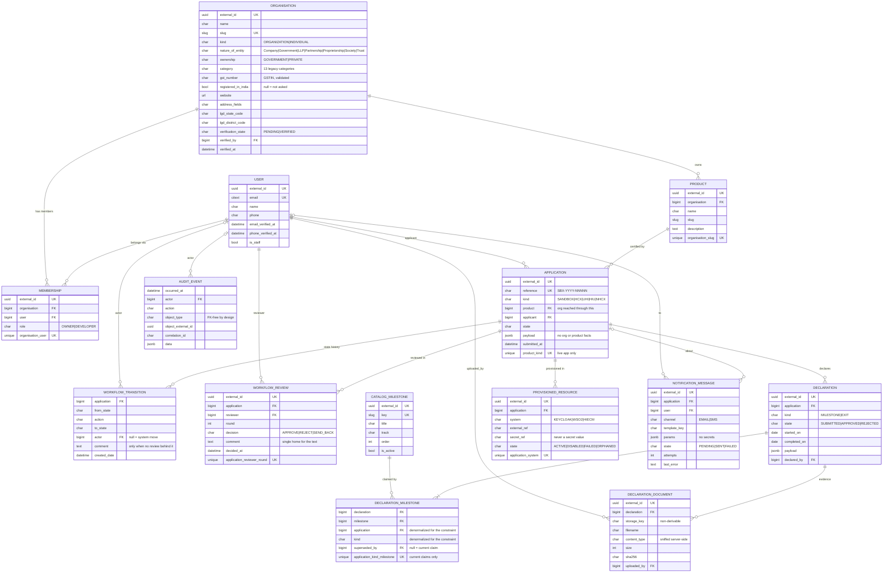

# 03 — Database

**Parent:** [00-master-plan.md](00-master-plan.md) · **Audience:** backend engineers · **v0 tickets:** [A1–A9](v0-tickets/README.md), [B1](v0-tickets/B1-integration-ports-http-policy.md)

---

## 1. In plain words

One Postgres database, whose entire shape is defined by Django migrations — check out the repo, run `migrate`, and you have the exact schema, every time. Records that outsiders can reference use a random UUID (`external_id`), never a guessable number. Nothing is ever really deleted (a `deleted` flag hides it instead), and the tables that _are_ history (workflow transitions, audit events) can never be edited at all. Where the five application types differ, the differences live inside a versioned JSON column instead of five near-identical table sets.

## 2. Legacy findings

No migrations tooling (manual dated ALTER scripts — schema unreproducible); sequential enumerable IDs everywhere; `SdLogin` at ~75 columns; `SdStatus` wide table with per-reviewer column triplets; column-per-milestone `self_declaration`; plaintext integrator secrets in `sd_status.gen_securate`; 40+ per-request CTE dashboards; `Mst*` seed tables of unknown provenance.

## 3. Design

### 3.1 Base model (care conventions — adopted from the care backend)

Every model extends a shared abstract base mirroring care's `BaseModel`:

| Field           | Type     | Notes                                                                                               |
| --------------- | -------- | --------------------------------------------------------------------------------------------------- |
| `external_id`   | UUID     | `default=uuid4`, unique, db-indexed — **the only URL identity**; integer PKs never leave the system |
| `created_date`  | datetime | `auto_now_add`, indexed                                                                             |
| `modified_date` | datetime | `auto_now`, indexed                                                                                 |
| `deleted`       | bool     | soft delete; default manager filters `deleted=False`; `delete()` flips the flag                     |

Audit-bearing models add `created_by` / `updated_by` (`SET_NULL`, `%(app_label)s_%(class)s_*` related names — care's `EMRBaseModel` pattern).

Rules that follow from soft delete:

- **Every UNIQUE on a soft-deletable table is a partial unique index** (`… WHERE deleted = false`) — otherwise a soft-deleted row blocks re-creation.
- Append-only tables (`workflow_transition`, `audit_event`) do **not** carry `deleted` or `modified_date` — rows are immutable; the app DB role has no UPDATE/DELETE grants on them.

### 3.2 Other principles

- Django migrations are the single schema source; no manual SQL scripts.
- Real FKs, explicit indexes reviewed against the selector query set; CHECK constraints for enums and states.
- **Versioned JSONB payloads**: envelope `{"schema_version": N, "data": {…}}`, validated on write against the per-kind schema registry; upgrades ship as data migrations; fields needed for relational filtering get promoted to real columns.
- No secret values in app tables — `secret_ref` (secret-store reference) only.
- Human `reference`s (`SBX-YYYY-NNNNN`, `SBX-T-NNNN`, `CR-NNNN`) are display-only; lookups resolve by `external_id`.

### 3.3 Entity overview

State/district are **not** modelled: LGD is external reference data, held as a bundled dataset in v0 and read through the `LgdLookup` adapter from P4 ([A1](v0-tickets/A1-catalog-app.md)). Organisations store the chosen codes as plain values, so neither source change can break a saved address.

v1 adds: `CONFORMANCE_PACK/CASE/RUN/RESULT`, `APPLICATION_CALLBACK`, `SUPPORT_TICKET/MESSAGE/ATTACHMENT`, `CONTENT_NODE`/FAQ/resources/snippets, `CATALOG_AGENT_SKILL`, `WORKFLOW_ASSIGNMENT` (reviewer routing — arrives in P3 with the requirements that decide its shape).

Cluster guide: **identity & tenancy** (user ⇄ org via membership — the tenancy boundary; org-scoped querysets 404 outside it; an org's products are what actually get certified) · **application core** (one row per enrollment; kind + versioned payload; one live app per (product, kind)) · **workflow** (denormalized `state` on the application; truth = append-only transitions; reviewer opinions = advisory review rows in rounds — approval is an admin permission check, not a quorum) · **evidence** (declarations + sha256'd documents; v1 adds conformance) · **provisioning ledger** (one row per (application, system) — the idempotency backstop) · **comms & audit** (delivery log; FK-free audit events).

### 3.4 Table specs

Field-by-field specs live in the tickets — they are the authoritative table definitions for v0:

| Tables                                                                                                      | Ticket                                                 |
| ----------------------------------------------------------------------------------------------------------- | ------------------------------------------------------ |
| `catalog_milestone`                                                                                         | [A1](v0-tickets/A1-catalog-app.md)                     |
| `users_user` (extension), `organisations_organisation`, `organisations_product`, `organisations_membership` | [A2](v0-tickets/A2-users-organisations-org-scoping.md) |
| `applications_application` (+ partial-unique live app per product, payload envelope)                        | [A3](v0-tickets/A3-applications-model.md)              |
| `workflow_transition`, `audit_event`                                                                        | [A5](v0-tickets/A5-workflow-state-machine.md)          |
| `workflow_review`                                                                                           | [A6](v0-tickets/A6-reviews-quorum.md)                  |
| `declarations_declaration`, `declarations_declaration_milestone`, `declarations_document`                   | [A7](v0-tickets/A7-declarations-uploads.md)            |
| `notifications_message`                                                                                     | [B6](v0-tickets/B6-notification-adapter.md)            |
| `integrations_provisioned_resource`                                                                         | [B1](v0-tickets/B1-integration-ports-http-policy.md)   |

## 4. v0 (POC)

- All §3.4 tables + migrations + admin; seeds for catalog ([A1](v0-tickets/A1-catalog-app.md)).
- **`seed_sandbox_demo`** ([A9](v0-tickets/A9-seed-sandbox-demo.md)) — idempotent, `--fresh`-scoped, seeds via real services so history is legal; the fixture for local dev, e2e and staging.
- Append-only enforcement migration (revoke UPDATE/DELETE) on transitions + audit.

**Exit criteria:** `migrate` from zero reproduces the schema; seed twice ⇒ no dupes; constraints proven in tests.

## 5. v1 — everything else

| Item                                                                                                                                                                               | Phase     | Notes                                               |
| ---------------------------------------------------------------------------------------------------------------------------------------------------------------------------------- | --------- | --------------------------------------------------- |
| Conformance tables (`conformance_pack/case/run/result`)                                                                                                                            | P4/P5     | seeded, versioned packs                             |
| `applications_callback` (HIP/HIU endpoints + probe status)                                                                                                                         | P4        |                                                     |
| Support tables (`support_ticket/message/attachment`, SLA timestamps)                                                                                                               | P5        | reuses the A7 upload pipeline                       |
| Content tables (`content_node/faq/resource/snippet`) + **Postgres FTS** (tsvector + GIN)                                                                                           | P5        | replaces Strapi + Meilisearch                       |
| `notifications_message.channel` gains `IN_APP` (+ `read_at`)                                                                                                                       | P5        | notification centre                                 |
| `catalog_agent_skill`; LGD daily sync refreshing catalog                                                                                                                           | P4/P5     |                                                     |
| Reporting materialized views (`reporting_mv_*`) refreshed by beat                                                                                                                  | P5        | golden-data parity vs legacy snapshot gates cutover |
| **Content migration:** snapshot archive (JSON + uploads, checksummed) → idempotent `import_legacy_content` → verify → freeze + delta → decommission Strapi/Meilisearch immediately | P5        | snapshot is the permanent rollback                  |
| Legacy data cutover decision (migrate vs re-enroll)                                                                                                                                | before P5 | open question #1                                    |

## 6. Definition of done

**v0**

- [ ] `migrate` from zero reproduces the full schema; every table on the base model (external_id, timestamps, soft delete); no secrets in schema.
- [ ] Partial-unique constraints include `deleted = false`; review comments single-homed on review rows; append-only enforcement verified.
- [ ] Seed command idempotent; `--fresh` touches only its rows.

**v1**

- [ ] FTS backing docs + ⌘K; reporting parity signed off on a legacy snapshot before cutover; content migration rollback tested.
