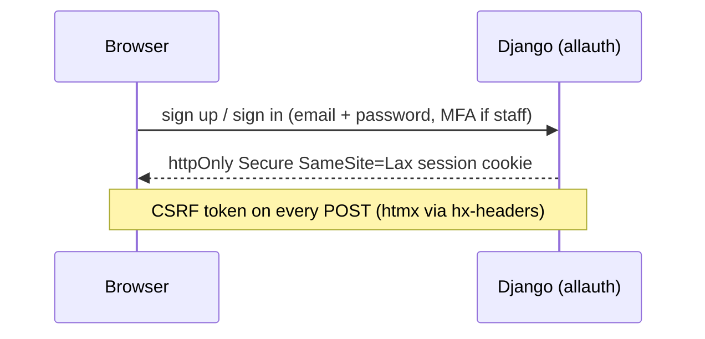

# 05 — Security

**Parent:** [00-master-plan.md](00-master-plan.md) · **Audience:** every engineer (authz idioms are everyone's job)

---

## 1. In plain words

Two kinds of "login" exist and never mix. **People** (integrators, reviewers, admins) sign into the portal with an email + password (staff also need a one-time code — MFA); their browser holds only a session cookie. **Machines** (the integrator's software) authenticate with a Keycloak client id + secret that we show exactly once and never store. Nobody's secret ever sits in our git repo, our database, our logs, or an email. Authorization is structural: you can only ever query your own organisation's records (anything else looks like it doesn't exist), and every URL's access rules are asserted by an automated test matrix, so a forgotten permission check fails CI, not production.

## 2. Legacy findings

Committed to git: prod DB/Redis passwords · Keycloak client secret · WSO2 admin creds · global bypass password · RSA private key · signing keystore (password `changeit`) · two gateway JWTs in the FE `.env` (shipped in the bundle). `local` profile pointed at prod RDS/Redis. `permitAll()` + MD5 + committed bypass. Plaintext integrator secrets in `sd_status.gen_securate`; credentials emailed in plaintext.

## 3. Design

### 3.1 Auth model

- **Portal users:** django-allauth — Argon2, rate-limited login, **one `VerificationRequiredMiddleware`**: staff/reviewer roles must hold TOTP MFA, everyone else must OTP-verify both email and phone (allauth's own email-confirmation link is off — OTP is the single mechanism), session idle + absolute timeouts, Redis-backed sessions.
- **No tokens in the browser, ever.** No localStorage, no JWT parsing, no client-side role checks.
- **Integrator machine credentials:** Keycloak-issued client id/secret validated by Keycloak/WSO2 at runtime; portal shows the secret once + offers rotation ([C7](v0-tickets/C7-credentials-panel.md)). A Keycloak outage degrades credential management, never portal login.
- **Authorization:** Django groups/permissions; org scoping via queryset mixins (**404, not 403** — [A2](v0-tickets/A2-users-organisations-org-scoping.md)); console gate mixin; the route-gate matrix ([C3](v0-tickets/C3-route-gate-harness.md)) is the enforcement proof.

### 3.2 Application hardening

- Deny-by-default URLs: everything login-required except an explicit public allowlist (home, auth, healthz).
- `SECURE_*` production settings (HSTS, referrer policy, frame-deny); CSP without `unsafe-inline` scripts (htmx is self-hosted; nonce the bootstrap inlines).
- Uploads: extension + sniffed-MIME + size validation, private buckets, presigned GETs, AV-scan hook ([A7](v0-tickets/A7-declarations-uploads.md)).
- OTP: Redis token bucket per identity + IP; constant-time compare; attempt caps ([A4](v0-tickets/A4-otp-service.md)). No captcha carry-over.
- Admin (`/django-admin/`) staff + MFA only, IP-allowlisted at Traefik.

### 3.3 Secrets

- Zero secrets in repo/images/templates — gitleaks + Trivy CI gates (live since V0.1).
- Runtime secrets via environment from the platform secret store; settings guard refuses `DEBUG` + non-local DB/Redis (built in V0.1).
- Integrator client secrets **never persisted by us** (show-once + rotate); `secret_ref` references only where an adapter genuinely needs a copy ([B3](v0-tickets/B3-keycloak-adapter.md)/[B4](v0-tickets/B4-wso2-adapter.md)).

## 4. v0 (POC)

Everything in §3 ships in v0 (most of §3.1/§3.3 exists from V0.1). v0-specific proof points:

- Route-gate matrix complete over every shipped URL, CSRF asserted on mutations ([C3](v0-tickets/C3-route-gate-harness.md)).
- Show-once/rotation semantics tested in-browser ([C7](v0-tickets/C7-credentials-panel.md)); secret absent from DB/logs/audit/emails (grep + log-capture assertions).
- Upload abuse tests (oversize, spoofed MIME) green ([A7](v0-tickets/A7-declarations-uploads.md)).
- Rejection deprovisions all three external systems ([B8](v0-tickets/B8-deprovisioning-chain.md)); sandbox token lifetime ≤15m documented.

**Exit criteria:** authz matrix sign-off at the V0.4 go/no-go.

## 5. v1 — everything else

| Item                                                                                          | Phase                                         |
| --------------------------------------------------------------------------------------------- | --------------------------------------------- |
| Pen test: authz matrix, IDOR (external_id-only lookups), CSRF, session fixation, upload abuse | P6 (required before public GA, not the pilot) |
| CSP report-only burn-in → enforce                                                             | P6                                            |
| Rich-text sanitize-on-save (bleach allowlist) for the content app                             | P5                                            |
| Real AV integration behind the A7 hook                                                        | P5/P6                                         |
| Rotation runbook cadence (quarterly + on-incident) for platform secrets                       | P6                                            |

## 6. Definition of done

**v0**

- [ ] gitleaks/Trivy gates enforced; MFA enforced for all console roles.
- [ ] Matrix green (wrong-org 404s, console 403s, CSRF); no secret in DB/logs/templates (asserted).

**v1**

- [ ] Pen test passes; CSP enforced; no dependency-audit waiver older than 30 days.
