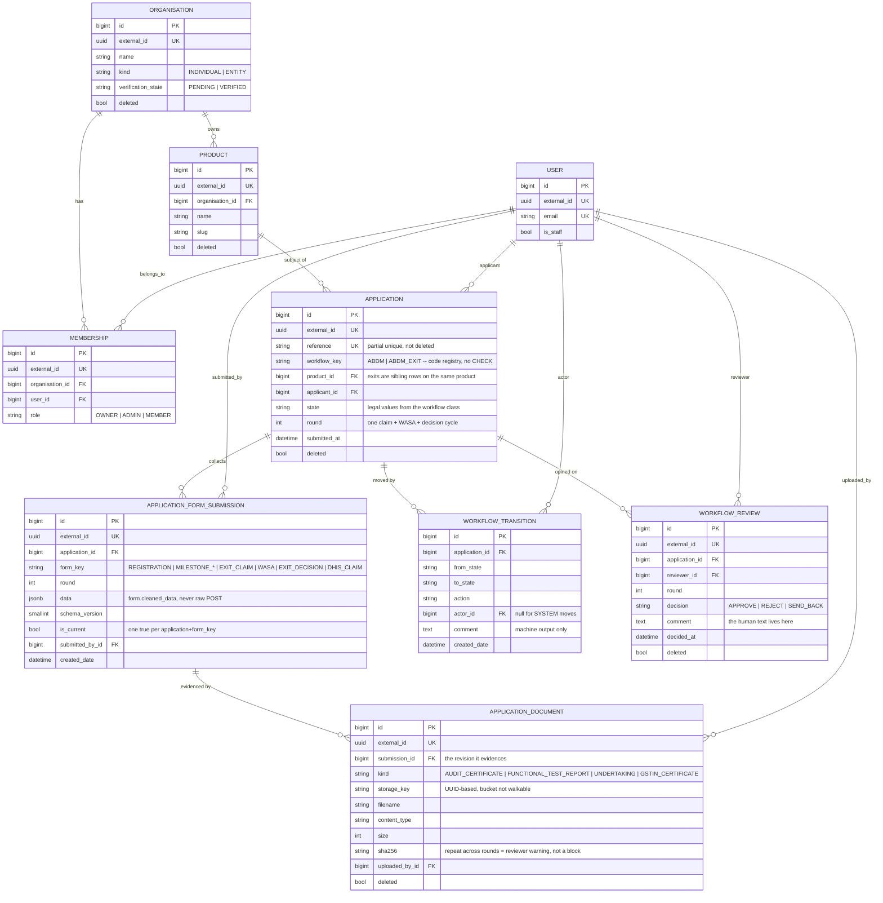
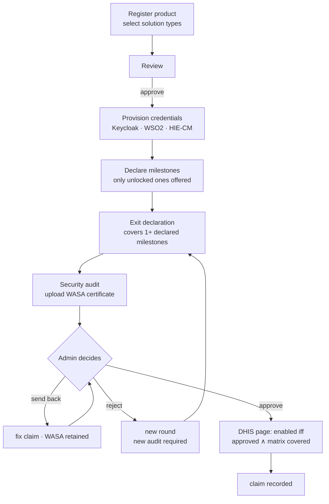

# 09 — Domain redesign: code as the source of truth

**Status:** draft, for review · **Created:** 2026-08-31 · **Supersedes** the domain-model half of [01-backend.md](01-backend.md) §3 and [03-database.md](03-database.md) §3.2, and answers master-plan open questions 3 and 5. Facts about the live process are verified in [10-production-truth.md](10-production-truth.md); its §6 deltas are folded in below.

> **Legacy is reference only.** The legacy portal is bug-ridden and its data model collapsed three orthogonal axes into one word. Everything below is derived from the NHA flow specification and the worked examples, not from legacy behaviour. Where legacy is mentioned it is to name a trap we are avoiding, never to justify a shape.

---

## 1. In plain words

An integrator registers a **product**, says which **solution types** it is (HMIS, LMIS, Telemedicine, Health Locker, Pharmacy), gets sandbox credentials, builds, and declares **milestones** as they finish them. When enough milestones are done they file an **exit declaration** covering some of those milestones, get a **security audit**, upload the audit agency's **WASA certificate**, and NHA reviews it. On approval, the solution types whose milestone requirements are fully covered become claimable on the DHIS registration page.

The whole product is that sentence. The design below exists to make that sentence expressible in code that a reviewer can read in one sitting, and to stop anybody changing it through a database row or an admin screen.

## 2. The one rule

| Owned by **code** | Owned by the **database** |
| --- | --- |
| which workflows exist | which workflow a row is, and its state |
| which states and transitions are legal | the append-only record of every move |
| which forms a workflow has, their order and dependencies | the validated data a user submitted |
| the solution-type matrix and milestone DAG | file evidence |
| what "complete", "exitable" and "claimable" mean | who did what, when |

Everything in the left column changes only by code deploy and code review. There is no table, no admin screen and no JSON blob from which a flow can be reshaped at runtime. This is a deliberate lockdown: the legacy system let flow live in mutable data and nobody could answer "what happens next?" without reading the database.

**Corollary:** `state`, `action`, `workflow_key` and `form_key` are plain `CharField`s. No `TextChoices`, no `CheckConstraint`. Their legal values come from the registry in code. §9 covers what that costs.

In code they are **not loose strings**. Shared `StrEnum`s — `Milestone`, `SolutionType`, `DocumentKind`, and per-workflow `State` / `Action` enums — are the vocabulary, and different workflows refer to the *same* enum: `SOLUTION_TYPE_MILESTONES` maps enum members, not literals. A typo is an `AttributeError` at import time and mypy checks every reference; the database just stores the enum's string value in a plain column. Enum in code, char in the DB — the lockdown loses nothing to ergonomics.

---

## 3. Tables

Six, down from eight. Every one extends `BaseModel` (`external_id`, `created_date`, `modified_date`, soft delete) except the two append-only ones, which must not be editable or soft-deletable.

### 3.1 `applications.Application`

One row per workflow instance. An exit is a workflow instance, so an exit is a row here too.

| Column | Type | Notes |
| --- | --- | --- |
| `reference` | char(15) | human-facing id, partial-unique where `deleted = false` |
| `workflow_key` | char(50) | resolved against the code registry — `"ABDM"`, `"ABDM_EXIT"` |
| `product` | FK `organisations.Product`, PROTECT | the only anchor an exit needs — see below |
| `applicant` | FK user, PROTECT | |
| `state` | char(40) | written only by `engine.transition()` |
| `round` | positive int, default 1 | one review cycle; see §5.3 |
| `submitted_at` | datetime, null | |

There is deliberately **no `parent` FK**. An exit belongs to a product, and the sandbox application it exits from *is* that product's `ABDM` application — storing both `product` and a parent pointer would be two paths to the same fact, needing a constraint to stop them disagreeing. An application accrues many exits over its life (M1 in January, M2 in September) simply as sibling rows on the same product. A pleasant consequence: production grants survive a sandbox re-enrollment, because they hang off the product, not off whichever application row happened to be live.

Constraints kept: partial-unique `reference`; partial-unique **one in-flight application per `(product, workflow_key)`** — excluding the resting states `REJECTED`, `WITHDRAWN` and `APPROVED`. One condition serves both workflows: `APPROVED` is not an `ABDM` state, and for exits it is exactly what lets January's approved exit sit beside September's in-flight one while forbidding two exits under review at once. Constraints dropped: the `kind` and `state` enum checks.

`ApplicationReferenceCounter` (year, last_value) stays as-is.

### 3.2 `applications.ApplicationFormSubmission`

One immutable revision of one form's validated data. This is where every answer a human ever gives now lives.

| Column | Type | Notes |
| --- | --- | --- |
| `application` | FK, PROTECT | |
| `form_key` | char(50) | resolved against the workflow's form list |
| `round` | positive int | the review cycle this was submitted in |
| `data` | JSONB | output of `form.cleaned_data`, never raw POST |
| `schema_version` | small int | bumped when a form's fields change incompatibly |
| `is_current` | bool | exactly one true per `(application, form_key)` |
| `submitted_by` | FK user, PROTECT | |

One structural constraint, and only one:

```python
models.UniqueConstraint(
    fields=["application", "form_key"],
    condition=models.Q(is_current=True, deleted=False),
    name="applications_one_current_submission",
)
```

Resubmission inserts a new row and flips the previous one's `is_current` to false, inside one transaction. Data is never rewritten — the only column that ever changes on an existing row is `is_current` — so the history of what a client claimed at each round survives without a `superseded_by` pointer. Submissions are never deleted, soft or otherwise: like transitions, they are the record.

**Repeatable forms never set `is_current`.** A `repeatable = True` form (`DHIS_CLAIM`) is pure history — every submission is a distinct event, nothing supersedes anything, and readers use all rows. This is what keeps one partial unique index serving both kinds of form: the constraint only sees `is_current = true` rows, and repeatable forms never write one.

### 3.3 `applications.ApplicationDocument`

`DeclarationDocument` re-pointed at **`ApplicationFormSubmission`**, plus a `kind` saying what it is. `DocumentKind` has four members, straight from the production exit form ([10-production-truth.md](10-production-truth.md) §3): `FUNCTIONAL_TEST_REPORT`, `AUDIT_CERTIFICATE` (the WASA/Safe-to-Host certificate), `UNDERTAKING` (which also has a signed hard copy sent by post — receipt is recorded by staff, see §4.3), and `GSTIN_CERTIFICATE`. `storage_key` stays UUID-based so the bucket cannot be walked; `sha256` stays, and §5.3 gives it a second job.

It hangs off the submission rather than the application because a WASA certificate evidences **one round's** claim, not the application in general. Round two's certificate must be a different document from round one's, and scoping the `sha256` check to "this exit's submissions" is only meaningful if the document knows which revision it belongs to.

### 3.4 `workflow.WorkflowTransition`

Unchanged, except `from_state` / `to_state` / `action` become plain `char` and the three enum checks go. Still append-only, still with UPDATE and DELETE revoked from the application's database role.

### 3.5 `workflow.WorkflowReview`

Unchanged. It already carries `round`, which §5.3 now leans on, and it already FKs to `Application` — which is why reviewers work on exits for free.

### 3.6 Together



`ApplicationReferenceCounter` is omitted: it has no relationships, it is a sequence in a table.

Note what is *not* here. There is no milestone table, no declaration table, no claim-to-milestone join table, no per-programme table, and no table describing states, transitions or forms. Everything structural is one `workflow_key` and one `form_key`, both resolved in code.

---

## 4. Code

### 4.1 Layout

```
sandbox/workflow/
    definitions.py    FormDefinition, Workflow, Context   (base classes, no DB writes)
    registry.py       workflow_key -> Workflow
    engine.py         transition(), submit_form()          (the only writers)
sandbox/programmes/
    abdm.py           ABDMWorkflow, ABDMExitWorkflow, the matrix, the DAG
    hcx.py  uhi.py  hiu.py  nhcx.py                        (v1)
```

`definitions.py` imports no models and touches no database, exactly as `machine.py` does today — importing it is free, which is what lets the console, the engine and the tests all read the same source of truth.

### 4.2 Base classes

```python
class FormDefinition:
    key: ClassVar[str]
    label: ClassVar[str]
    form_class: ClassVar[type[forms.Form]]
    depends_on: ClassVar[tuple[str, ...]] = ()
    required: ClassVar[bool] = True
    repeatable: ClassVar[bool] = False
    requires_document: ClassVar[str] = ""  # a DocumentKind, or ""
    schema_version: ClassVar[int] = 1
    #: submit_form refuses a submission while the application is in any other
    #: state. This is what makes "the claim becomes editable on send-back" a
    #: mechanism instead of a hope, and what stops a REGISTRATION resubmission
    #: moving the solution-type ceiling under an already-granted decision.
    editable_states: ClassVar[frozenset[str]]
    actor_kind: ClassVar[ActorKind] = ActorKind.OWNER
    permission: ClassVar[str] = ""  # required when actor_kind is STAFF

    @classmethod
    def is_applicable(cls, ctx: Context) -> bool:
        return True

    @classmethod
    def is_unlocked(cls, ctx: Context) -> bool:
        return cls.is_applicable(ctx) and all(
            ctx.has_current(key) for key in cls.depends_on
        )


class Workflow:
    key: ClassVar[str]
    label: ClassVar[str]
    forms: ClassVar[tuple[type[FormDefinition], ...]]
    initial_state: ClassVar[str]
    terminal_states: ClassVar[frozenset[str]]
    transitions: ClassVar[dict[tuple[str, str], Spec]]
```

`Spec` is today's `machine.Spec` — `to_state`, `actor_kind`, `permission`, `hooks`, `guards` — moved onto the workflow class so each programme owns its own graph. Nothing about it changes.

`Context` is a read-only bundle handed to every predicate: the application, the user, their permissions, and `{form_key: current submission}` prefetched in one query. It offers `has_current(form_key)` and `has_current_at_round(form_key)` — the latter is what makes a stale WASA unable to satisfy a new round — plus `product_has_current(workflow_key, form_key)`, one extra selector that reads a **sibling application** on the same product. That last method is what lets a programme reuse another programme's milestone claims: `HCXWorkflow` can declare in code that it accepts the product's ABDM `MILESTONE_M1`, without copying data, without a join table, and without UHI silently inheriting the same rule — each workflow opts in explicitly, which is the lockdown principle applied to reuse.

### 4.3 The ABDM programme, in full

This is the entire "matrix and DAG" that legacy spread across a React component, a CSV column and a wide table:

```python
class Milestone(StrEnum):
    M1 = "M1"
    M2 = "M2"
    M3 = "M3"
    PHR = "PHR"
    HEALTH_LOCKER = "HEALTH_LOCKER"


class SolutionType(StrEnum):
    HMIS = "HMIS"
    LMIS = "LMIS"
    TELEMEDICINE = "TELEMEDICINE"
    HEALTH_LOCKER = "HEALTH_LOCKER"
    PHARMACY = "PHARMACY"


M, S = Milestone, SolutionType

MILESTONE_PREREQS: dict[Milestone, tuple[Milestone, ...]] = {
    M.M1: (),
    M.M2: (M.M1,),
    M.M3: (M.M1,),  # M3 does NOT require M2
    M.PHR: (),
    M.HEALTH_LOCKER: (M.PHR,),
}

SOLUTION_TYPE_MILESTONES: dict[SolutionType, frozenset[Milestone]] = {
    S.HMIS: frozenset({M.M1, M.M2, M.M3}),
    S.LMIS: frozenset({M.M1, M.M2}),
    S.TELEMEDICINE: frozenset({M.M1, M.M2, M.M3}),
    S.HEALTH_LOCKER: frozenset({M.PHR, M.HEALTH_LOCKER}),
    S.PHARMACY: frozenset({M.M1, M.M2}),
}
```

Milestone forms are generated from the DAG rather than written five times:

```python
class Registration(FormDefinition):
    key = "REGISTRATION"  # {"solution_types": [SolutionType, ...], ...}
    form_class = RegistrationForm
    # PROVISIONED is deliberate: an integrator may widen their solution-type
    # selection later ("edit integration profile" on the dashboard — the same
    # submit_form path, a new revision, history retained). The admin ceiling in
    # ExitDecisionForm validates against the registration current at decision
    # time, so a widening grants nothing until an exit decision passes review.
    editable_states = frozenset({"DRAFT", "SENT_BACK", "PROVISIONED"})


def _milestone_form(key: str) -> type[FormDefinition]:
    return type(
        f"Milestone{key}",
        (FormDefinition,),
        {
            "key": f"MILESTONE_{key}",
            "label": MILESTONE_LABELS[key],
            "form_class": MilestoneDeclarationForm,
            "depends_on": tuple(f"MILESTONE_{p}" for p in MILESTONE_PREREQS[key]),
            "required": False,  # you declare what you built, not all of it
        },
    )
```

The exit workflow's three forms:

```python
class ExitClaim(FormDefinition):
    key = "EXIT_CLAIM"  # {"covers": [Milestone, ...]}
    form_class = ExitClaimForm  # validates covers ⊆ declared milestones
    editable_states = frozenset({"DRAFT", "SENT_BACK"})
    # production exit form: FT report + GSTIN ride on the claim itself
    requires_document = (
        DocumentKind.FUNCTIONAL_TEST_REPORT,
        DocumentKind.UNDERTAKING,
        DocumentKind.GSTIN_CERTIFICATE,
    )


class Wasa(FormDefinition):
    key = "WASA"  # {"start": date, "valid_upto": date}
    depends_on = ("EXIT_CLAIM",)
    requires_document = (DocumentKind.AUDIT_CERTIFICATE,)
    editable_states = frozenset({"DRAFT", "SENT_BACK"})


class ExitDecision(FormDefinition):
    key = "EXIT_DECISION"  # {"approved_solution_types": [SolutionType, ...],
    form_class = ExitDecisionForm  #  "undertaking_hard_copy_received_on": date | None}
    actor_kind = ActorKind.STAFF  # validates approved ⊆ registered
    permission = "workflow.approve_application"
```

The integrator submits the exit claim and the WASA; reviewers and the admin review; the decision comes back with the verdict. `EXIT_DECISION` is therefore **never submitted through `submit_form`** — the engine writes it itself, inside the `APPROVE_EXIT` transition, in the same transaction as the state change and the transition row. One door: a decision row cannot exist without its transition, and a transition cannot land without its decision. `submit_form` refuses any `STAFF`-kind form outright.

The decision also records the two facts the portal cannot verify itself: that the signed **Undertaking hard copy arrived by post**, and — for claims covering M1 — the reviewer's confirmation that the implementation is on **V3 APIs** (production accepts no M1 exit on V1/V2). Both are review-checklist items, not portal-enforceable rules; likewise the two demos production runs (internal demo after FT approval, HTC demo after exit review) are recorded as `WorkflowReview` rows with comments, not as states. The functional-testing step itself is entirely off-portal — the dashboard shows guidance (empaneled agencies, the 7-working-day timebox, the NHA report template) and the portal sees only its evidence.

`EXIT_DECISION` being a submission rather than columns on the exit row is what stops an approval overwriting the applicant's own answers — the legacy system mutated `sd_login.solution_type` at approval time and destroyed what was actually asked for.

One more ABDM form closes the loop at the DHIS end — recording only, since DHIS itself enforces claim-once:

```python
class DhisClaim(FormDefinition):
    key = "DHIS_CLAIM"  # {"solution_type": SolutionType, "claimed_at": ...}
    repeatable = True
    editable_states = frozenset({"PROVISIONED"})
```

### 4.4 Four predicates, deliberately named apart

These are four different questions and the legacy system conflated them. Each gets its own name so no call site can use the wrong one by accident.

```python
def milestone_unlocked(ctx, key) -> bool:  # may this form be filled?
    return all(ctx.has_current(f"MILESTONE_{p}") for p in MILESTONE_PREREQS[key])


def exit_gate(ctx) -> bool:  # may this exit be submitted?
    covers = ctx.form_data("EXIT_CLAIM").get("covers", [])
    return (
        bool(covers)
        # milestone claims live on the sibling ABDM application, not the exit
        and all(ctx.product_has_current("ABDM", f"MILESTONE_{m}") for m in covers)
        and ctx.has_current_at_round("WASA")
    )


def covered(product) -> frozenset[Milestone]:  # union over approved exits
    """Each approved exit contributes the claim as it stood at its decided
    round. Approvals are additive: an approved exit only ever adds."""
    return frozenset().union(
        *(
            claim_at(exit, exit.decided_round)["covers"]
            for exit in approved_exits(product)
        )
    )


def approved_types(product) -> frozenset[SolutionType]:
    return frozenset().union(
        *(
            decision_at(exit)["approved_solution_types"]
            for exit in approved_exits(product)
        )
    )


def dhis_enabled(product, solution_type) -> bool:  # is the button live?
    return solution_type in approved_types(product) and SOLUTION_TYPE_MILESTONES[
        solution_type
    ] <= covered(product)


def is_compliant(product) -> bool:  # reporting only; gates nothing
    required = set().union(*(SOLUTION_TYPE_MILESTONES[s] for s in registered(product)))
    return required <= covered(product)
```

`is_compliant` is the one an executive dashboard wants. It gates nothing, ever. An integrator may legitimately take M1 to production while M3 is outstanding, and treating compliance as a gate would forbid that.

Note what `dhis_enabled` reads: **approved decisions and the claims as they stood when decided** — never a live claim, never an in-flight exit. A second exit under review grants nothing until its decision lands, and an approved exit's grant is never revoked by anything that happens later. This is how "exit M1 in January, M2 in September" works: two exits, and the union grows.

### 4.5 The engine

Two write paths, and only two.

```python
def submit_form(application, form_definition, cleaned_data, user, document=None):
    """Insert a new current revision; supersede the previous.

    Refuses unless: the application's state is in the form's editable_states,
    the actor matches actor_kind (and permission), every depends_on form has a
    current submission, and the required document is attached. Stamps the row
    with the application's current round.
    """


def transition(application, action, actor, comment="", *, decision_data=None):
    """The only code that writes Application.state. Unchanged in shape from A5.

    Deciding transitions (APPROVE_EXIT) take the decision form's cleaned data
    and write the STAFF submission themselves, same transaction — the decision
    and the move cannot exist without each other.
    """
```

`transition()` keeps everything it has today — guard registry, hook registry, actor-kind checks, `transaction.atomic` + `on_commit` dispatch, an audit event and a `WorkflowTransition` row per move. The only change is that it looks the graph up on `application.workflow` instead of a module-level dict.

Two implementation notes both writers share. **Locking:** each takes `select_for_update` on the application row, so a concurrent resubmission cannot race the `is_current` flip past the partial unique index, and a transition cannot interleave with a submission it should have refused. **Documents carry forward:** when a new revision supersedes an old one and no replacement file is uploaded, the engine re-links the superseded revision's documents to the new row — a send-back for a typo must not force the client to re-upload four PDFs. Uploading a file of the same `kind` replaces the carried one.

---

## 5. The flow

### 5.1 End to end



### 5.2 As rows

```
Application  workflow_key="ABDM"  state=PROVISIONED  product=…
├─ AFS  REGISTRATION    r1  {"solution_types": ["HMIS", "HEALTH_LOCKER"]}
├─ AFS  MILESTONE_M1    r1  {"started_on": …, "completed_on": …}
├─ AFS  MILESTONE_M2    r1  {…}
├─ AFS  MILESTONE_M3    r1  {…}
├─ AFS  MILESTONE_PHR   r1  {…}
├─ Application  workflow_key="ABDM_EXIT"  product=(same)  state=APPROVED  round=2   (January)
│  ├─ AFS  EXIT_CLAIM     r1  {"covers": ["M1","M2"]}            is_current=false
│  ├─ AFS  WASA           r1  {…}  + AUDIT_CERTIFICATE (sha256 A)
│  ├─ AFS  EXIT_CLAIM     r2  {"covers": ["M1","M2","M3"]}       is_current=true
│  ├─ AFS  WASA           r2  {…}  + AUDIT_CERTIFICATE (sha256 B)   ← round 1 rejected; major fix, fresh audit
│  └─ AFS  EXIT_DECISION  r2  {"approved_solution_types": ["HMIS"]}
└─ Application  workflow_key="ABDM_EXIT"  product=(same)  state=UNDER_REVIEW  round=1   (September)
   ├─ AFS  EXIT_CLAIM     r1  {"covers": ["PHR","HEALTH_LOCKER"]}
   └─ AFS  WASA           r1  {…}  + AUDIT_CERTIFICATE (sha256 C)
```

Today HMIS is enabled (January's grant); Health Locker lights up if and when September's exit is approved. Neither exit knows about the other — the union in §4.4 is the only place they meet.

### 5.3 Rounds

A round is one complete attempt: **one claim, one WASA, one decision.**

The reason rounds exist rather than free-form revisions is that a rejection can have a real-world price. A rejected exit means the integrator changes code, and per production's own rules ([10-production-truth.md](10-production-truth.md) §3 step 2) a **critical or major** change — anything touching the backend — voids the Safe-to-Host certificate and forces a fresh audit. A **minor** fix does not: a valid certificate is explicitly reusable. Whether the fix was minor is a judgement only the reviewer can make, so the system must distinguish rounds without pretending to know the answer.

Rules, all in code:

- `REJECT` parks the exit in `REJECTED` (a resting state — it is what frees the one-in-flight constraint). `RESUBMIT` re-enters `DRAFT` **and increments `Application.round`**.
- `exit_gate` requires a `WASA` submission **at the current round** — the applicant must re-state, each round, which certificate carries the claim. Re-submitting the same certificate after a minor fix is legitimate.
- A new round's `AUDIT_CERTIFICATE` repeating a `sha256` already used on this exit raises a **console warning for the reviewer** — "same certificate as the rejected round" — never a hard block. Production's reuse rules make the same PDF sometimes right and sometimes wrong; the reviewer, not the code, judges which.
- `EXIT_DECISION` is stored at the round it decided, and the engine stamps `round` onto submissions and reviews from `Application.round` at write time, so the three copies cannot drift.
- **`round` is a review-cycle counter on every application, not just exits.** On the `ABDM` workflow, resubmitting after `SENT_BACK` advances it too — otherwise `workflow_review_unique_per_round` would stop a reviewer from reviewing the corrected submission. Exits merely give the counter its richer claim/WASA semantics.
- Rounds are scoped to **one application**. Taking further milestones to production later is a *new exit*, not a new round — a round exists only to make a rejected attempt distinguishable from its resubmission.

**Reject and send back must therefore be genuinely different actions.** `SEND_BACK` is for a wrong tick-box or an unreadable scan: the claim becomes editable, the round does not advance, the WASA is retained, and it costs the client minutes. `REJECT` is for a deficient integration: new round, and — when the fix is major — a fresh audit cycle. The legacy system set `EXIT_REJECTED` and then emailed the send-back template — with the cost asymmetry above, that conflation is not untidy, it is expensive. The console must state the consequence before an admin presses reject.

### 5.4 States

| Workflow | States |
| --- | --- |
| `ABDM` | `DRAFT` → `SUBMITTED` → {`SANDBOX_APPROVED` → `PROVISIONING` → `PROVISIONED` \| `PROVISIONING_FAILED`, `SENT_BACK`, `REJECTED`}; `WITHDRAWN` from most |
| `ABDM_EXIT` | `DRAFT` → `SUBMITTED` → `UNDER_REVIEW` → {`APPROVED`, `REJECTED`, `SENT_BACK`} |

`ABDM_EXIT.APPROVED` is terminal: taking more milestones to production is a new exit on the same product, and the approved exit's grant persists untouched. `REJECTED` is re-enterable via `RESUBMIT`, which advances the round (§5.3). The five exit states that used to sit on the sandbox application are gone.

---

## 6. Worked scenarios

Registration selects `["HMIS", "HEALTH_LOCKER"]` throughout. These are the acceptance criteria of the redesign — they become a parametrised test.

| # | covered by approved exits (union) | approved types (union) | enabled | why |
| --- | --- | --- | --- | --- |
| 1 | M1 M2 PHR | HMIS, HL | — | HMIS lacks M3; HL lacks HEALTH\_LOCKER |
| 2 | M1 M2 M3 PHR | HMIS, HL | HMIS | HL still lacks HEALTH\_LOCKER |
| 3 | M1 M2 M3 PHR HL | HMIS, HL | HMIS, HL | both rows satisfied |
| 4 | M1 M3 | HMIS | — | legal DAG path, no matrix row satisfied |
| 5 | M1 M2 M3 PHR HL | HMIS | HMIS | admin narrowed; HL covered but not approved |
| 6 | exit's round 1 rejected; round 2 covers all | HMIS, HL | HMIS, HL | round 1 contributes nothing |
| 7 | exit 1 approved (M1 M2 M3); exit 2 in review | HMIS | HMIS | an in-flight exit grants nothing |
| 8 | exit 1 (M1 M2 M3 → HMIS); exit 2 (PHR HL → HL), both approved | HMIS, HL | HMIS, HL | additive union; January's grant persists |

Scenarios 1 and 4 are the point of the whole design: a **valid, legally submitted, admin-approved** exit that enables nothing. Any model in which "approved" implies "done" gets these wrong. Scenario 8 is the other half: an application exits piecemeal over the year and only becomes *compliant* once every selected solution type's row is covered.

Scenario 5 is the one legacy could not represent without destroying data.

Two negative cases at the form layer, which never reach the exit at all:

- `MILESTONE_HEALTH_LOCKER` is not offered until `MILESTONE_PHR` has a current submission — the illegal state is unreachable, not caught late.
- `EXIT_DECISION` refuses `approved_solution_types` containing anything outside the registration's selection. The console renders only the selected types as checkboxes, pre-ticked; there is no affordance to add one.

---

## 7. What this deletes

| Gone | Replaced by |
| --- | --- |
| `Application.payload` | one submission row per form |
| `applications/schemas/` — envelope + registry, 205 lines | `FormDefinition.form_class` |
| `catalog.Milestone` table | the DAG in code |
| `declarations.Declaration` | `EXIT_CLAIM` / `MILESTONE_*` submissions |
| `declarations.DeclarationMilestone` — supersession, denormalised `application` + `kind`, 2 constraints | `is_current` on the submission |
| `declarations.DeclarationState` | the exit workflow's own states |
| 5 exit states on `ApplicationState` | the `ABDM_EXIT` workflow |
| `ApplicationKind` enum | `workflow_key` + registry |
| `notifications.hooks._decision_comment()` | one comment home per decision |
| most of `sandbox/declarations/` (~1,100 lines) | generic submission views |

`catalog` shrinks to the LGD lookup. Provisioning is untouched: production keys are per **product**, so the chain still reads no form data.

## 8. Migration

Two migrations, neither of which needs a data backfill in v0 because no production data exists on the new stack yet:

1. Add `ApplicationFormSubmission`, `ApplicationDocument`, `Application.workflow_key`, `Application.round`; relax the enum constraints.
2. Move existing rows' `payload` into a `REGISTRATION` submission, `Declaration` rows into `MILESTONE_*` / `EXIT_CLAIM` submissions, `DeclarationDocument` into `ApplicationDocument`; then drop the four dead tables. (This backfill exists for dev/staging continuity only.)

The legacy-portal cutover (master-plan open question 1) is unaffected and still unanswered — but it gets easier, because the target shape is now "a form submission per thing the client told us", which is what the legacy wide rows are once unpivoted.

## 9. Trade-offs accepted

**Dropping the enum `CheckConstraint`s.** A stray `.update(state="TYPO")` would now succeed at the database level. Three mitigations: `state` is written only by `engine.transition()`; the same was already true in practice, since the old constraints validated each column independently and never the `(from_state, action, to_state)` triple — `LEGAL_EDGES` claimed a constraint that does not exist; and one test asserts every distinct `state`, `action`, `workflow_key` and `form_key` in the database is known to the registry.

**JSONB instead of columns.** `covers` is a JSON list, so "who covered M3?" is a containment query rather than a join. Postgres GIN-indexes that adequately at the scale of a sandbox; if reporting outgrows it, a projection table is additive.

**A form's fields are code, so changing them is a deploy.** That is the intent. `schema_version` on each submission means old rows stay readable after a field changes.

### 9.1 Enforcing the lockdown

The danger being designed out is the earlier modelling's mistake: flow configurable through the database or the UI. Assertions are not enforcement, so four teeth:

1. **The Django admin gets no write access to domain tables.** `Application`, `ApplicationFormSubmission`, `ApplicationDocument` and the workflow tables are registered read-only (`has_change_permission` / `has_delete_permission` return `False`) or not at all. This matters doubly because Django's `ModelBackend` short-circuits every permission check to `True` for superusers — the admin *surface*, not the permission system, is the line.
2. **The registry-sanity test is a CI release gate.** Every distinct `state`, `action`, `workflow_key` and `form_key` persisted in the database must be known to the code registry. A workflow change that would orphan in-flight rows fails the pipeline until its author ships the accompanying data migration — which is what "changes to workflows are very deliberate" means operationally.
3. **A lint-imports contract** (the repo already runs `lint-imports`) permits only `workflow.engine` to import the write paths, turning "state is written only by the engine" from a docstring into a build failure.
4. **UPDATE and DELETE stay revoked** at the database-role level on the append-only tables (`workflow_transition` today; `application_form_submission` joins it, except column-level UPDATE on `is_current`).

## 10. Decisions

Settled with NHA:

1. The admin **cannot** approve a solution type the applicant did not select. Selection is a hard ceiling; the admin may only unselect.
2. WASA start / valid-upto are **applicant** data, submitted after the exit claim, evidenced by an audit agency's certificate.
3. A rejection voids the WASA; resubmission requires a fresh audit.
4. **Reviewers are involved** in exit review, not admin only.
5. Production keys are per **product**, not per solution type.

Closed by this document:

- **Master-plan open question 3** (is exit per track and repeatable?) — **yes, repeatable**: an application accrues exits over its life (M1 in January, M2 in September), each covering a subset of milestones. Approved exits are additive; their union is what DHIS enablement and compliance read; a grant is never revoked. Within one exit, rejection advances the round and demands a fresh WASA.
- **Expanding the solution-type selection after approval** — the applicant re-submits `REGISTRATION` (editable in `PROVISIONED`), surfaced in the UI as "edit integration profile" on the product dashboard. The admin ceiling validates against the registration as it stands at decision time, so past decisions stay valid and a widened selection grants nothing until the next exit decision passes review. The admin still cannot add a type the applicant never selected — the ceiling's job is stopping the admin inventing scope, not stopping the applicant growing theirs. No account re-review is triggered: production verifies solution types at the change-status/exit step, never at account level, and our checkpoint is the same. The exit review screen must show a "registration changed since the last decision" diff of `REGISTRATION` revisions, so the reviewer verifies the widening rather than discovering it.
- **Master-plan open question 5** (may a `DRAFT` hold half-finished work?) — dissolved. With one submission per form, a draft is partial by construction and resumable for free. The tension existed only because `payload` was validated as a single blob.

Defaults taken, open to veto:

- One WASA per round. If a single round can carry several certificates covering different milestones, `Wasa.repeatable = True` and the claim references which certificate covers which milestone.
- An expired WASA does not disable a DHIS button; the dates are passed downstream and enforced there, as claim-once is.
- Reviewers may `SEND_BACK` but not `REJECT` on an exit, because a rejection now costs the client an audit cycle. This also answers master-plan open question 10 for the exit surface.

Still open, unaffected:

- Master-plan open questions 1 (legacy cutover), 2, 4, 6–9.
