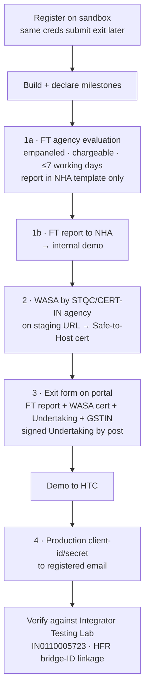

# 10 — Production truth: the live sandbox's entry/exit process and FAQ

**Status:** reference · **Created:** 2026-08-31 · **Sources (production, authoritative):**
[Sandbox Entry & Exit journey](https://sandbox.abdm.gov.in/sandbox/v3/new-documentation?doc=SandboxExit) ·
[FAQ](https://sandbox.abdm.gov.in/sandbox/v3/faq) (content pulled from the live CMS, all five categories).

> These pages describe the process as NHA runs it **today**. Where they conflict with an assumption in
> [09-redesign.md](09-redesign.md), this document wins and the delta is flagged in §6.

---

## 1. Entry

- Registering on the sandbox creates the login credentials (email + password). **The same credentials submit the Exit form later** — one account carries the whole journey.
- NHA recommends a designation-based email (e.g. `xyz@entityname.com`); **all notifications, integration updates and access credentials go exclusively to this address**.
- Who may participate: any entity **or individual** — HMIS, LMIS, PHR app, Health Locker, health-tech or tech company.

## 2. The milestones (as NHA defines them)

| Key | Official meaning |
| --- | --- |
| **M1** | ABHA creation (optional) + capture & verification for patient registration. Aadhaar / Mobile / Driving Licence today; PAN & Passport in progress. Also covers discovering/verifying existing ABHAs. **Exit for M1 is accepted only on V3 APIs — V1/V2 implementations are rejected.** |
| **M2** | Health Information Provider (HIP): link clinical records to ABHA, consent-based sharing, records viewable in any PHR app. |
| **M3** | Health Information User (HIU): consume records with patient consent; longitudinal records in FHIR. Consent flow: HIU requests → HIE-CM acks with a consent-request id → patient notified → grant/deny. |

Supporting facts the portal's docs will need: `X-CM-ID` is `sbx` in sandbox and `ndhm` in production; HIP/HIU service ids come from HFR registration; key generation is required every exchange; HIU stores the key pair to decrypt.

## 3. The exit process — four steps, two of them off-portal

### Step 1a — Functional Testing (off-portal, chargeable)

- Performed by an **NHA-empaneled FT agency** (9 today: AKS IT, Avasure, AQM, Code Decode Labs, ESF Labs, FIME, Nangia & Co, Oxygen Consulting, Suma Soft) — integrator engages and pays directly.
- **Hard timebox: total FT duration must not exceed 7 working days from onboarding with the agency**, and the report must reach ABDM within that window.
- The report is only accepted **in the NHA-approved standard template**.
- Grievances during FT go to `integration.support@nha.gov.in`.

### Step 1b — Internal demo by NHA (off-portal)

FT reports are submitted to NHA for approval; on approval NHA schedules an **internal demo** with the integrator, to verify the agency actually tested the defined scenarios.

### Step 2 — WASA / Safe-to-Host (off-portal, chargeable)

- Security testing of the web/mobile application by any **STQC or CERT-IN empaneled agency**; the deliverable is a **"Safe-to-Host" certificate** submitted to NHA.
- Conducted on the **staging URL**; the certificate is licensed to the same application in production. Always required before production hosting.
- STQC may independently spot-validate sample applications.

**The consolidated WASA reuse rules** (deduped from ~10 FAQ answers — this is the definitive matrix):

| Situation | New WASA needed? |
| --- | --- |
| No Safe-to-Host certificate exists for the application | Yes — full application |
| Valid Safe-to-Host certificate already exists | **No** |
| Certificate exists but has **expired** | Renew per certificate validity |
| **Minor** code changes | **No** — "the said can be ignored" |
| **Critical/major** changes (anything affecting backend etc.) | Yes |
| Add-on module added to a certified application | Yes — **for the module only**, "subtracting the application part"; base certificate must still be valid |
| One codebase serving multiple milestones/modules | One WASA, but **all modules must be built before applying** |
| iOS app + Android app + website | **Three separate WASAs** — common base URL does not exempt clients |

### Step 3 — HTC approval (the on-portal step)

The final go-live approval is sought from NHA's internal team (**HTC — Health Tech Committee**). The applicant presents:

1. Functional testing report(s) for the completed integrations
2. Safe-to-Host (WASA) certificate
3. **The Exit form on the sandbox portal**, filled for the milestone(s) with HTC go-ahead, with attachments:
   - FT certificate & reports
   - WASA certificate
   - **Undertaking** — and a **hard copy, duly signed, sent by courier/speed-post to the NHA office**
   - **GSTIN certificate**

After the exit form is reviewed, a **demonstration of the implemented milestones to HTC** is scheduled; the demo is part of the approval.

### Step 4 — Production access

- On approval, **production client-id and secret are shared separately to the registered email**; the secret is confidential.
- Verification path: link through the multi-HRP construct against the ABDM production **test facility "Integrator Testing Lab" (`IN0110005723`)** and test health-record linkage; support at `abdm.pc13@nha.gov.in`.
- A partnering HIP must be registered on the **Health Facility Registry** and update the production bridge ID in its HFR profile before interfacing.

## 4. Sequence, in one picture

## 5. FAQ facts not already covered

- Milestone prerequisites for integration: create sandbox credentials → generate bearer token → register endpoint URL on `dev.abdm.gov.in/devservice/v1/bridges`.
- A patient without an ABHA can still be registered (name/DoB/gender/mobile); the facility notifies HIE-CM against the mobile number only — no record type or demographics shared.
- The "Integration queries" FAQ category has been reduced to a single downloadable PDF (last updated 20-Nov-2025) — the CMS content is going stale in favour of documents.
- Error-code tables, SNOMED-CT licensing and FHIR references exist in the FAQ but concern integrators' builds, not the portal.

## 6. What this changes in [09-redesign.md](09-redesign.md)

1. **The sha256-uniqueness rule in §5.3 is wrong as stated.** Production rules allow the *same* Safe-to-Host certificate to be legitimately reused: after minor changes, and while the certificate is valid. A rejection only forces a fresh WASA when the fix is a critical/major change. The rule should soften to a console *warning* on a repeated `sha256`, not a hard guard — the reviewer, not the code, judges whether the change was minor.
2. **`DocumentKind` needs four members, not two:** `FUNCTIONAL_TEST_REPORT`, `AUDIT_CERTIFICATE` (Safe-to-Host/WASA), `UNDERTAKING`, `GSTIN_CERTIFICATE`. The exit claim's `requires_document` becomes a tuple.
3. **The Undertaking has a physical half** — a signed hard copy by post. The exit needs an admin-side checkbox/field ("hard copy received on …"), which naturally lives on `EXIT_DECISION` or a small staff-editable form; the portal cannot verify it itself.
4. **Two demos punctuate the exit review** (internal demo after FT approval; HTC demo after exit-form review). These are review *activities*, not new states — `WorkflowReview` rows with comments cover them, and the console should encourage recording them. Confirms reviewers-on-exits (HTC is real and plural).
5. **M1 exits are V3-API-only** — an exit-review checklist item, not a portal-enforceable rule.
6. **FT has a 7-working-day timebox** — worth surfacing on the integrator dashboard as guidance; not enforced by the portal since FT happens off-portal.
7. **Production credentials go out by email today** — the redesign's show-once credentials panel deliberately replaces this; no change, just confirmation the legacy practice is real.
8. **WASA is per-application (product), scoped by module** — consistent with §3's product anchoring; a WASA certificate evidences the product's staging URL, and module-level WASAs map cleanly onto exits covering milestone subsets.

---

## TL;DR (condensed)

**Exit = FT agency (≤7 days, NHA template) → NHA internal demo → WASA/Safe-to-Host (staging URL, STQC/CERT-IN) → exit form on portal (FT report + WASA cert + Undertaking incl. hard copy by post + GSTIN) → HTC demo → production keys by email → verify against Integrator Testing Lab.**

**WASA reuse:** valid cert ⇒ reuse; expired ⇒ renew; minor change ⇒ keep; major/backend change ⇒ redo; new module ⇒ audit the module only; iOS/Android/web ⇒ three separate certs; multi-module single WASA ⇒ build everything first.

**Redesign deltas:** soften the duplicate-sha256 guard to a warning · 4 document kinds on the exit · record hard-copy Undertaking receipt · demos are review rows, not states · M1 = V3-only checklist item.
