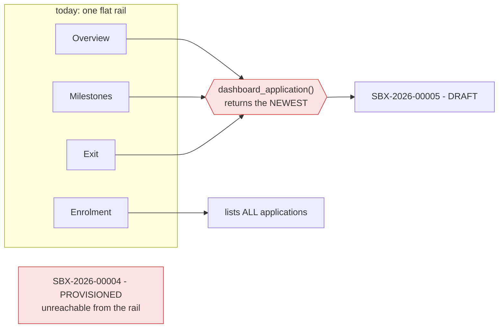
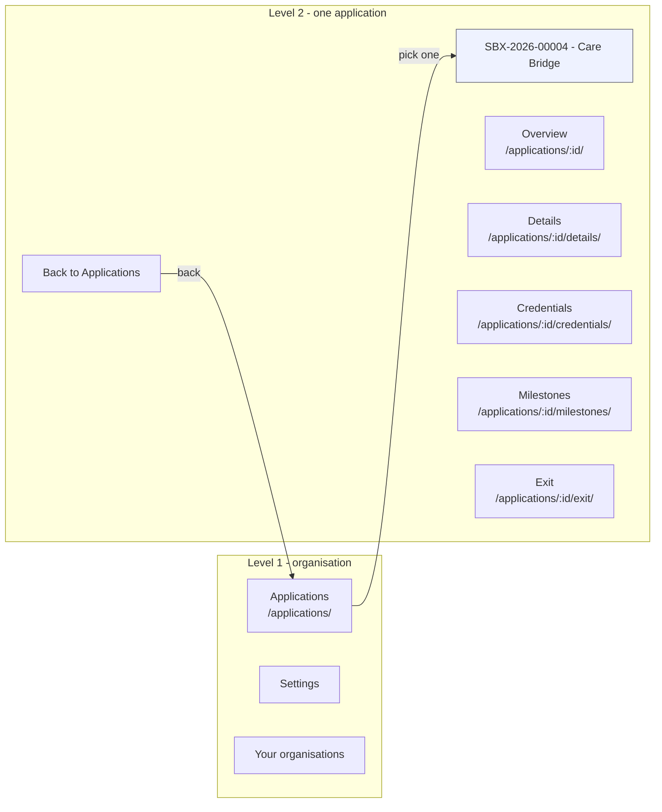
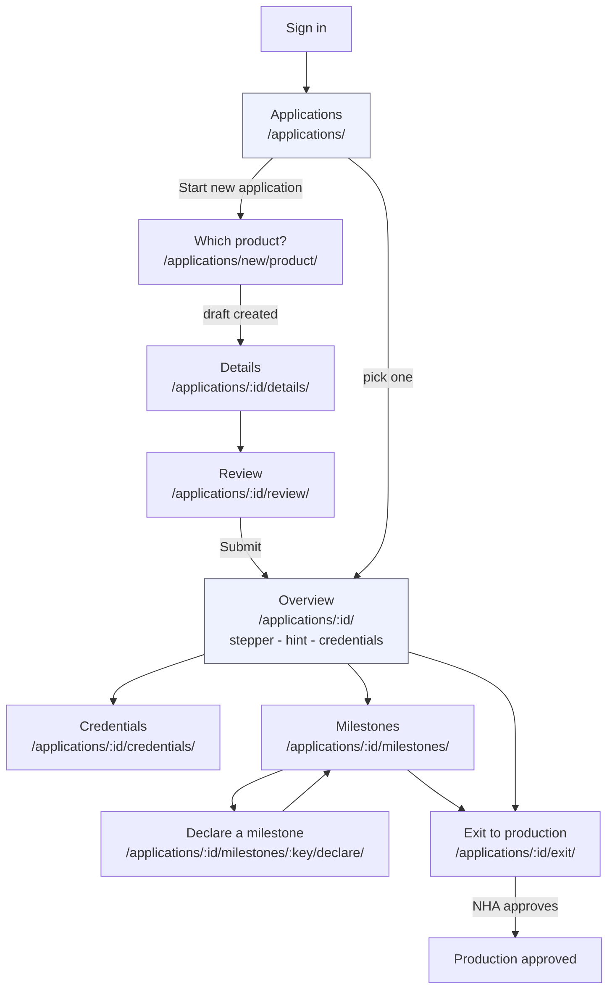
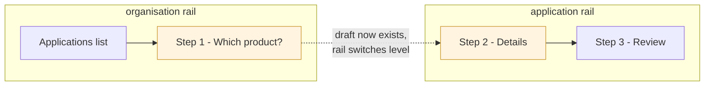

# C11 — Application-scoped shell: two-level navigation

> **Lane** C — Full-stack UI · **Phase** V0.4 Milestones, exit & pilot readiness
> **Depends on** [C4](C4-enrollment-wizard.md) (wizard), [C6](C6-integrator-dashboard.md) (dashboard), [C7](C7-credentials-panel.md) (credentials panel), [C8](C8-milestone-exit-forms.md) (milestones + exit), [C10](../02-ui.md) (app shell)
> **Unblocks** [C9](C9-playwright-e2e.md) — its specs should be written against the final URLs, not these
> **Refs** [02-ui.md §3.2](../02-ui.md) · [03-database.md §3.4](../03-database.md)

## In plain words

Sandbox access is granted **per product**, so an organisation can hold several applications at once. The sidebar does not know which one you mean. Today three of its items — Overview, Milestones, Exit — each guess, and they all guess the same way: the newest application. An organisation with a live sandbox and a fresh draft beside it gets the draft, and every declaration screen quietly refuses to work.

This ticket stops the guessing. **Applications** becomes a list; picking one takes you inside it, and the sidebar becomes that application's own sections.

## Background

`applications.selectors.dashboard_application()` returns the newest application for an organisation. It was written for [C6](C6-integrator-dashboard.md), when an organisation effectively had one, and its docstring justifies newest-first on the grounds that "a rejected or withdrawn one leaves the slot free for a fresh attempt". That reasoning holds for REJECTED and WITHDRAWN. It does not hold for a DRAFT sitting beside a PROVISIONED application, which is the ordinary case as soon as someone certifies a second product.

[C8](C8-milestone-exit-forms.md) inherited the selector for its milestones and exit screens, and the enrolment list it added is what made the problem visible: the list shows every application, and then the nav item beside it silently talks about one of them.

The fix is not a better heuristic. A milestone claim belongs to an application — `declaration_milestone.application` is a foreign key, and the exit bundle is per-application too. The navigation has to carry the same fact.

Three items funnel through one guess, and a fourth shows the truth right beside them.

This also removes a duplication [C8](C8-milestone-exit-forms.md) introduced: **Dashboard and Enrolment are both organisation-level list-ish pages**. They merge.

## What to build

### Deliverables

| #   | Deliverable                                                             | Where                                                    |
| --- | ------------------------------------------------------------------------ | ---------------------------------------------------------- |
| 1   | Applications list at `/applications/` (Dashboard + Enrolment merged)    | `sandbox/templates/applications/index.html` + view       |
| 2   | Per-application Overview at `/applications/<uuid>/`                     | `sandbox/templates/applications/overview.html` + view    |
| 3   | Two-level sidebar: org rail, replaced by the application's sections     | `sandbox/templates/components/app_nav.html`              |
| 4   | Milestones and exit moved under the application prefix                  | `sandbox/declarations/urls.py`, `config/urls.py`         |
| 5   | `dashboard_application()` and every caller deleted                      | `sandbox/applications/selectors.py`                      |
| 6   | Navigation and route-gate rows for both levels                          | `tests/test_navigation.py`, `tests/test_route_gates.py`  |

### Navigation

Entering an application **replaces** the rail rather than nesting under it. Nesting keeps your bearings but grows deep, and every screen would then carry items about a different application than the one you are reading.

The journey through those screens:

Every section is listed for every application, and each explains its own gate — Milestones on a DRAFT says declarations open once the sandbox is provisioned. Hiding sections until they work would make the rail change shape underneath the reader, and 02-ui.md's rule is that a nav link never points at a screen that does not exist. These exist; they are just not all actionable yet.

| Application state                  | Overview     | Details      | Credentials      | Milestones   | Exit         |
| ------------------------------------ | -------------- | -------------- | ------------------ | -------------- | -------------- |
| `DRAFT` / `SENT_BACK`              | yes          | **editable** | not yet          | not yet      | not yet      |
| `SUBMITTED` / `SANDBOX_APPROVED`   | yes          | read-only    | not yet          | not yet      | not yet      |
| `PROVISIONING`                     | yes+progress | read-only    | in progress      | not yet      | not yet      |
| `PROVISIONED`                      | yes          | read-only    | **reveal/rotate**| **declare**  | **request**  |
| `EXIT_REQUESTED` / `EXIT_REVIEW`   | yes          | read-only    | yes              | read-only    | under review |
| `EXIT_REJECTED`                    | yes          | read-only    | yes              | **declare**  | **re-request** |
| `PRODUCTION_APPROVED`              | yes          | read-only    | yes              | read-only    | approved     |

That last row deserves a second look. `PRODUCTION_APPROVED` is terminal, so once an exit is approved **no further milestone can ever be declared** — Milestones becomes a permanently dead section in the rail. C11 does not cause this (it is open question 3, already flagged in `machine.py`), but C11 is the first time it is visible as a place you can navigate to and never use again.

### URL map

| Now                                       | Becomes                                              |
| ------------------------------------------- | ------------------------------------------------------ |
| `/applications/` (Dashboard)              | `/applications/` — the list                          |
| `/applications/enrolment/`                | *merged away*                                        |
| —                                         | `/applications/<uuid>/` — Overview                   |
| `/applications/new/product/`              | unchanged                                            |
| `/applications/<uuid>/product/`           | unchanged                                            |
| `/applications/<uuid>/details/`           | unchanged                                            |
| `/applications/<uuid>/review/`            | unchanged                                            |
| `/applications/<uuid>/status/`            | unchanged (htmx fragment)                            |
| `/applications/<uuid>/credentials/`       | unchanged                                            |
| `/declarations/milestones/`               | `/applications/<uuid>/milestones/`                   |
| `/declarations/milestones/<key>/declare/` | `/applications/<uuid>/milestones/<key>/declare/`     |
| `/declarations/exit/`                     | `/applications/<uuid>/exit/`                         |
| `/declarations/documents/<uuid>/`         | unchanged — a document belongs to no single screen   |

`declarations/urls.py` splits into a per-application list, mounted under the applications prefix, and the shared document route. The views stay in the declarations app; only the mount point moves — the app boundary is still where the models are.

### What each screen becomes

- **Applications list** — reference, product, state, milestone progress, and the way in. Deliberately minimal: it exists to let you choose, not to summarise. The detail is one click away, which is why Overview earns its own page.
- **Overview** — what the C6 dashboard renders today: journey stepper, the per-state hint, the credentials panel ([C7](C7-credentials-panel.md)) and the milestone summary. Read-only.
- **Details** and **Review** stay separate wizard steps. Folding them into one editable section is tidier but rewrites [C4](C4-enrollment-wizard.md)'s three-step contract, and there is no defect forcing it.
- **The creation wizard keeps its stepper.** Product → details → review, unchanged.

### Decisions worth arguing with

- **The rail changes level mid-flow.** `/applications/new/product/` has no application yet, so step 1 of the wizard renders the organisation rail and steps 2 and 3 render the application rail. The stepper carries the continuity. The alternative — inventing a placeholder application before a product is chosen — puts a row in the database for a decision the user has not made.

- **Merging Dashboard into the list is a deletion, not a move.** The dashboard's *content* becomes Overview; the dashboard as an organisation-level screen stops existing. Anything that lands a user on `/applications/` after login now lands them on a list, including `users:redirect`.

## Acceptance criteria

- [x] An organisation holding a PROVISIONED application **and** a newer DRAFT can reach the provisioned one's milestones and declare against it.
- [x] `dashboard_application()` no longer exists, and nothing reintroduces "the" application for an organisation.
- [x] Every level-2 link answers the actor who is shown it, for an application in each of DRAFT / PROVISIONED / EXIT_REQUESTED / PRODUCTION_APPROVED.
- [x] Wrong-organisation application id 404s on every level-2 URL (never 403).
- [x] Route-gate rows for every new and moved URL; navigation test covers both levels.
- [x] Every mutation still passes with JS disabled.
- [x] djLint / i18n / mypy / ruff clean.

### Built differently from the plan, and why

- **`declarations` is mounted at the root, not under the applications prefix.** Its screens live at `/applications/<uuid>/...` but its download does not, and one namespace cannot be mounted at two prefixes without `reverse()` having to choose between them. The prefixes are spelled inside `declarations/urls.py` instead, with a note saying why.
- **`applications:new` is gone rather than repointed.** It was already deleted in [C8](C8-milestone-exit-forms.md) along with the redirect it served; nothing referenced it.
- **The wizard's Review step keeps a "Back to overview" link** rather than "Back to dashboard" — the dashboard it pointed at no longer exists.

## Out of scope (deferred)

Console-side navigation (already names its application) · switching application without returning to the list (a picker in the rail — P5) · per-application notification preferences · anything that changes what a section *does*, as opposed to where it lives.
