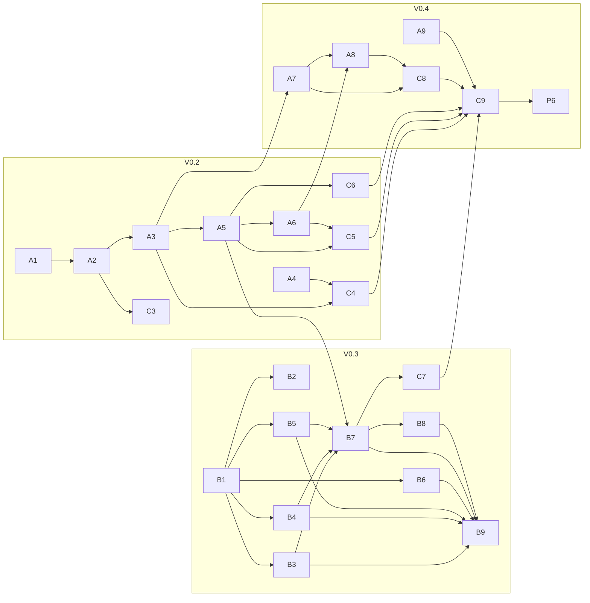

# v0 Tickets — Index

One standalone markdown file per v0 work item in [00-master-plan.md §6](../00-master-plan.md). Each ticket is self-explanatory: an engineer should be able to pick one up without reading the whole plan set (links to the reference docs are included for depth).

**Ticket anatomy** — every ticket follows the same shape:

| Section                 | Audience       | Contains                                                                                                   |
| ----------------------- | -------------- | ---------------------------------------------------------------------------------------------------------- |
| header block            | everyone       | lane · phase · depends-on/unblocks · doc refs                                                              |
| **In plain words**      | everyone       | what this is and why it matters, no jargon                                                                 |
| **Background**          | dev            | the legacy defect being fixed + design rationale                                                           |
| **What to build**       | dev            | a **Deliverables** table (exact artifact → exact path), then field tables / signatures / behaviour details |
| **Acceptance criteria** | dev + reviewer | testable checkboxes — done means all green                                                                 |
| **Out of scope**        | everyone       | deferred items, each naming its v1 phase                                                                   |

Three places record work that is _not_ done, and they mean different things:
**Out of scope** = a deliberate v1 deferral · [**§10 open questions**](../00-master-plan.md) =
blocked on an answer from NHA · [**Carry-over**](#carry-over) = in v0 scope, ticket
otherwise complete, blocked on a sibling ticket.

**Baseline assumption: V0.1 Foundation is complete** — it is: the repo is `sandbox-v2/` (Python 3.14, Django 6.0.x, cookiecutter-django layout). When any ticket here is picked up:

- monolith scaffold exists (`config/settings/{base,local,test,production}.py` + `guards.py`), uv + ruff + mypy + djLint + pre-commit (P1)
- `docker compose up` gives Django + Postgres 16 + Redis + Mailpit; non-root Dockerfiles (P2)
- CI enforces ruff / mypy / pytest / djLint / `makemigrations --check` / gitleaks / Trivy (P3)
- staging deploys behind Traefik, Sentry wired (P4); `DEBUG` + non-local DB host hard-fails (P5)
- careui design system ported from `ohcnetwork/experience` (Tailwind v4 standalone via django-tailwind-cli, no node; component classes in `sandbox/static/css/careui.css`; `` from `sandbox/theme/templatetags/careui.py`; htmx vendored) + `layouts/{marketing,app,console,error}.html` shells + messages/nav (C1)
- allauth flows work offline: sign-up → OTP verify email + phone → login; staff MFA enforced via `VerificationRequiredMiddleware` (C2)
- `sandbox/catalog/` app stub exists and hosts the `seed_sandbox_demo` skeleton
- real Keycloak / WSO2 / HIE-CM **sandbox-tier service accounts were requested during V0.1** (longest external lead time — Lane B should confirm access on day one)

**The v0 journey:** register → verify email → apply (SANDBOX kind) → review → provisioned credentials (Keycloak client + WSO2 subscription + HIE-CM bridge) → milestone declarations → exit → production approval.

## Done in V0.1 (no ticket files)

P1 scaffold · P2 compose/Dockerfiles · P3 CI gates · P4 staging+Sentry · P5 local-vs-prod guard · C1 careui port + layouts · C2 allauth templates.

## Lane P — Platform

| Ticket                                                                                    | Phase | Status |
| ----------------------------------------------------------------------------------------- | ----- | ------ |
| [P6 — Backup/restore drill + pilot runbook](P6-backup-restore-drill-and-pilot-runbook.md) | V0.4  | open   |

## Lane A — Backend: domain & workflow

| Ticket                                                                                                 | Phase     | Status                  |
| ------------------------------------------------------------------------------------------------------ | --------- | ----------------------- |
| [A1 ⚡ — `catalog` app: milestones, seeds, admin](A1-catalog-app.md)                                   | V0.2      | **done**                |
| [A2 — `users` + `organisations`, membership, org-scoping mixin](A2-users-organisations-org-scoping.md) | V0.2      | **done**                |
| [A3 — `applications` model: kind + payload envelope + SANDBOX schema](A3-applications-model.md)        | V0.2      | **done**                |
| [A4 — OTP service (Redis token bucket, attempt caps)](A4-otp-service.md)                               | V0.2      | **done**                |
| [A5 — Workflow state machine + `transition()` + audit events](A5-workflow-state-machine.md)            | V0.2      | **done**                |
| [A6 — Reviews + admin approve guard](A6-reviews-quorum.md)                                             | V0.2      | **done**                |
| [A7 — Declarations + document uploads](A7-declarations-uploads.md)                                     | V0.4      | **done**                |
| [A8 — Exit workflow + production approval](A8-exit-workflow.md)                                        | V0.4      | **done**                |
| [A9 ⚑ — `seed_sandbox_demo`](A9-seed-sandbox-demo.md)                                                  | V0.2→V0.4 | **V0.2 scope done**     |

## Lane B — Backend: integrations

| Ticket                                                                                       | Phase | Status                                |
| -------------------------------------------------------------------------------------------- | ----- | ------------------------------------- |
| [B1 — `integrations` ports + shared HTTP policy](B1-integration-ports-http-policy.md)        | V0.3  | **done** (1 carry-over)               |
| [B2 ⚑ — Fake adapters for every port](B2-fake-adapters.md)                                   | V0.3  | **done**                              |
| [B3 — Keycloak adapter (`IdpAdmin`)](B3-keycloak-adapter.md)                                 | V0.3  | **done** (1 carry-over)               |
| [B4 — WSO2 adapter (`ApiGateway`)](B4-wso2-adapter.md)                                       | V0.3  | blocked (NHA access)                  |
| [B5 — HIE-CM adapter (`BridgeRegistry`)](B5-hiecm-adapter.md)                                | V0.3  | blocked (NHA access)                  |
| [B6 — Notification adapter + Celery send task + delivery log](B6-notification-adapter.md)    | V0.3  | blocked (NHA access)                  |
| [B7 — Provisioning chain + ledger + `PROVISIONING_FAILED` + retry](B7-provisioning-chain.md) | V0.3  | blocked (B3–B6, A5)                   |
| [B8 — Deprovisioning chain (rejection path)](B8-deprovisioning-chain.md)                     | V0.3  | blocked (B7)                          |
| [B9 — WireMock contract + fault-injection suite](B9-wiremock-fault-injection-suite.md)       | V0.3  | open                                  |

## Lane C — Full-stack UI

| Ticket                                                                                         | Phase | Status           |
| ---------------------------------------------------------------------------------------------- | ----- | ---------------- |
| [C3 — Route-gate test harness](C3-route-gate-harness.md)                                       | V0.2  | **done**         |
| [C4 — Enrollment wizard (SANDBOX) + OTP partial](C4-enrollment-wizard.md)                      | V0.2  | open (A4 done)   |
| [C5 — Console: review queue + application detail + review actions](C5-console-review-queue.md) | V0.2  | **done**          |
| [C6 — Integrator dashboard + journey stepper](C6-integrator-dashboard.md)                      | V0.2  | open (A3/A5 done) |
| [C7 — Credentials panel: show-once, rotate, polling status](C7-credentials-panel.md)           | V0.3  | blocked (B7, C6)  |
| [C8 — Milestone + exit forms with uploads](C8-milestone-exit-forms.md)                         | V0.4  | open (A7/A8 done) |
| [C9 — Playwright e2e: full journey + JS-disabled pass](C9-playwright-e2e.md)                   | V0.4  | blocked (C4–C8)   |

⚑ = junior-suitable starter.

## Carry-over

Deliverables that are **in v0 scope** but did not ship with their ticket. Distinct
from a ticket's _Out of scope_ section (deliberate v1 deferrals) and from
[00-master-plan.md §10](../00-master-plan.md) (blocked on an external answer). A
ticket may be marked done with an open carry-over row; the row closes when the
unblocking ticket lands.

| From                                        | Deliverable                                                         | Blocked on                     | Notes                                                                                                                                                                                                                               |
| ------------------------------------------- | ------------------------------------------------------------------- | ------------------------------ | ----------------------------------------------------------------------------------------------------------------------------------------------------------------------------------------------------------------------------------- |
| [B1](B1-integration-ports-http-policy.md)   | `ProvisionedResource` ledger model + migration                      | [A3](A3-applications-model.md) | FK and `UNIQUE (application, system)` both need `applications.Application`. Only [B7](B7-provisioning-chain.md)/[B8](B8-deprovisioning-chain.md) consume it, and both are behind A3 anyway.                                         |
| [A4](A4-otp-service.md)                     | Stamping `email_verified_at` / `phone_verified_at` on verify        | —                              | Unblocked: A2 shipped both columns. Row closes when A4 lands.                                                                                                                                                                       |
| [B3](B3-keycloak-adapter.md)                | End-to-end verification against the real sandbox-tier Keycloak      | NHA service account            | Adapter is complete and verified against the local realm (roles land in a real token, GET does not rotate, disable revokes). Open question 4 also owes the per-kind role subset; ours is a documented default, changed by one env var. |

## Dependency sketch

`A9` (seed) starts in V0.2 and grows with every model-bearing ticket. B1/B2 can start the moment V0.1 lands, in parallel with Lane A.
